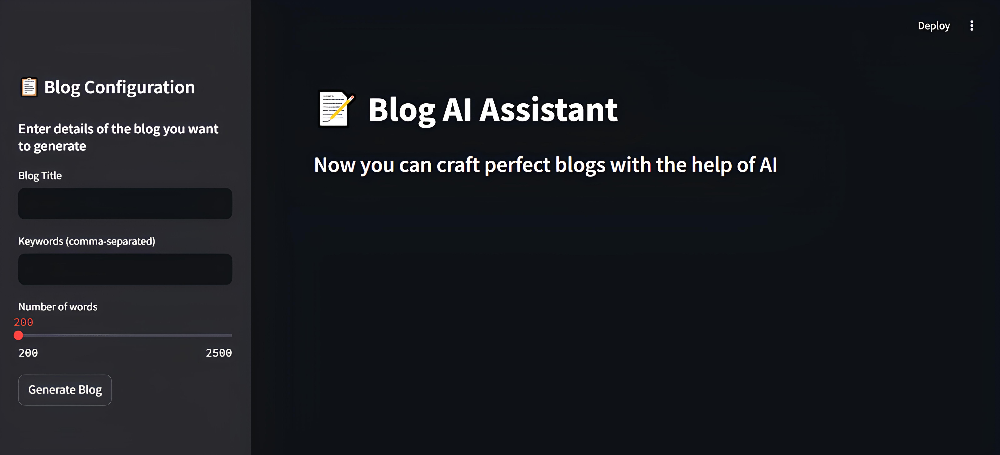
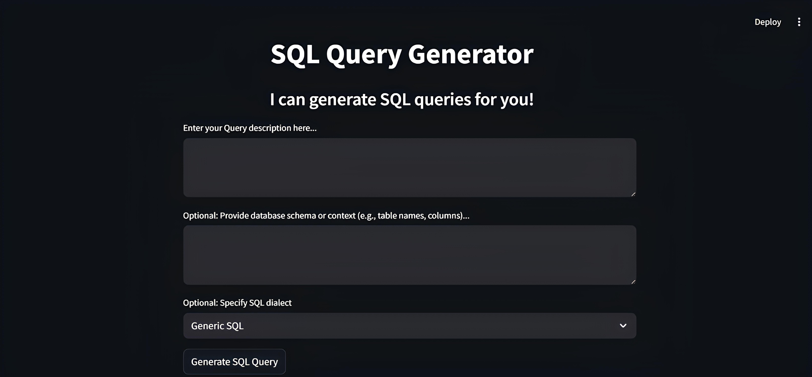
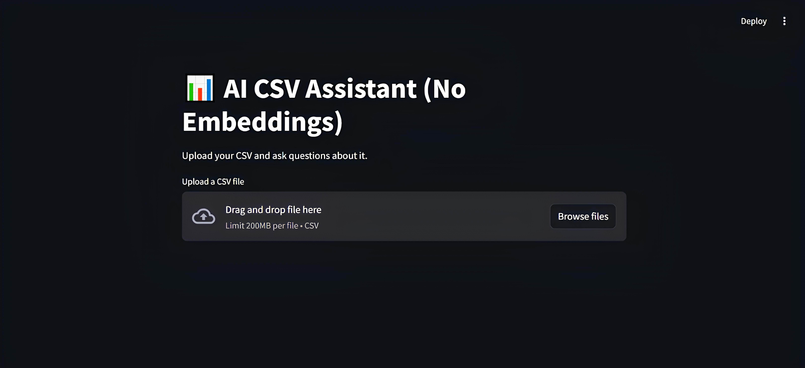

# LLM Projects Collection

Welcome to the **LLM Projects** repository — a growing collection of hands-on applications powered by **Large Language Models (LLMs)** like **Google Gemini 2.0 Flash** and **Meta's LLaMA 3.2**. This repo showcases real-world use cases built with **Streamlit**, focused on automating content creation and enhancing productivity with AI.

Whether you're a student, developer, or AI enthusiast, these projects demonstrate how to integrate cutting-edge LLMs into useful tools like blog generators, SQL query builders, and data analysis assistants.

---

## Projects Included

### 1. [AI Blog Assistant](./ai-blog-assistant)

Generate SEO-friendly blog posts with just a title and keywords. Built using **Gemini 2.0 Flash** and optionally powered by **LLaMA 3.2** for experimentation with open-source models.

**Features:**

* Input-based article generation
* Multi-model support (Gemini & LLaMA)
* SEO keyword handling
* Markdown export
* Beautiful, responsive UI

[View README](./ai-blog-assistant/README.md)

---

### 2. [AI SQL Query Generator](./ai-sql-query-generator)

Turn plain English into fully-formed SQL queries! This tool supports schema context, dialect customization, and offers AI-generated explanations and sample outputs.

**Features:**

* Converts natural language to SQL queries
* Supports Gemini 2.0 and LLaMA 3.2
* Accepts optional DB schema and dialect
* Returns SQL, explanation, and sample output
* Clean Streamlit interface

[View README](./ai-sql-query-generator/README.md)

---

### 3. [AI CSV Assistant](./ai-data-analyzer)

Upload a CSV file and interact with your dataset through natural language questions using either **Google Gemini** or **LLaMA 3.2** via **Ollama**. No embeddings or external databases required.

**Features:**

* Upload and preview CSV files
* Ask questions about your data
* Gemini or local LLaMA backend support
* No vector store needed
* Session-based Q\&A memory

[View README](./ai-data-analyzer/README.md)

---

## Getting Started

### 1. Clone the Repository

```bash
git clone https://github.com/MoustafaMohamed01/llm-projects.git
cd llm-projects
```

### 2. Navigate to Any Subproject

For example, to use the AI SQL Generator:

```bash
cd ai-sql-query-generator
pip install -r requirements.txt
```

### 3. Set Your API Key (for Gemini-powered apps)

Create a file named `api_key.py` inside the subproject folder:

```python
GEMINI_API_KEY = "your_google_gemini_api_key"
```

---

## Requirements

Each app has its own `requirements.txt`, but common dependencies include:

* `streamlit`
* `google-generativeai`
* `pandas`
* `requests`
* `json`

Install them globally or per-project as needed.

---

## Gallery

<table>
  <tr>
    <td></td>
    <td></td>
  </tr>
  <tr>
    <td colspan="2" align="center"></td>
  </tr>
</table>

---

## Author

**Moustafa Mohamed**
[LinkedIn](https://www.linkedin.com/in/moustafamohamed01/) • [GitHub](https://github.com/MoustafaMohamed01) • [Kaggle](https://www.kaggle.com/moustafamohamed01)
