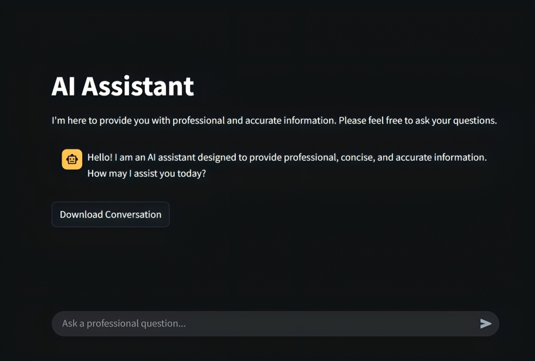

# AI Assistant Pro

**AI Assistant Pro** is a Streamlit-based chatbot that delivers **professional**, **accurate**, and **solution-focused** responses using **Google’s Gemini 2.0 Flash** model. Designed with a formal and respectful tone, it is ideal for use in business, academic, and professional contexts where clarity and factual accuracy are essential.

---

## Screeshot



---

## Key Features

- **Powered by Gemini 2.0 Flash** via Google's Generative AI API
- **Formal and Objective Responses** based on a tailored persona prompt
- **Persistent Chat Session** with context-aware replies
- **Clean UI** built with Streamlit
- **Exportable Conversation History** in `.txt` format
- **Robust Error Handling** for a smooth user experience

---

## Technologies Used

- **Python 3.8+**
- **Streamlit**
- **Google Generative AI SDK (Gemini)**
- **Markdown Formatting**

---

## Project Structure

```

ai-assistant-pro/
├── app.py                # Main application logic
├── api_key.py            # Secure API key configuration
├── requirements.txt      # Project dependencies
├── images/
│   └── screenshot.png    # Application screenshot
└── README.md             # Project documentation

````

---

## Getting Started

### 1. Clone the Repository

```bash
git clone https://github.com/MoustafaMohamed01/llm-projects.git
cd llm-projects/ai-assistant-pro
````

### 2. Install Dependencies

```bash
pip install -r requirements.txt
```

### 3. Configure Your Gemini API Key

Create a file named `api_key.py` in the root directory and add your Gemini API key:

```python
GEMINI_API_KEY = "your-gemini-api-key-here"
```

### 4. Run the Application

```bash
streamlit run app.py
```

---

## Application Overview

Upon launch, AI Assistant Pro:

* Greets the user in a formal tone
* Accepts user questions via a **Streamlit chat interface**
* Streams real-time AI responses from **Gemini 2.0 Flash**
* Maintains context and conversation history
* Allows exporting the chat as a **`.txt`** file for offline reference

---

## Exporting Chat Logs

You can download the entire conversation at any time by clicking the **"Download Conversation"** button, which exports it as a plain text file.

---

## Author

Created by **Moustafa Mohamed** - feel free to reach out!

* **GitHub**: [MoustafaMohamed01](https://github.com/MoustafaMohamed01)
* **Linkedin**: [Moustafa Mohamed](https://www.linkedin.com/in/moustafamohamed01/)
* **Kaggle**: [moustafamohamed01](https://www.kaggle.com/moustafamohamed01)
* **Portfolio**: [moustafamohamed](https://moustafamohamed.netlify.app/)

---

## ⭐ Support the Project

If you find this project helpful, consider giving it a ⭐ on GitHub or sharing it with your network.

---
