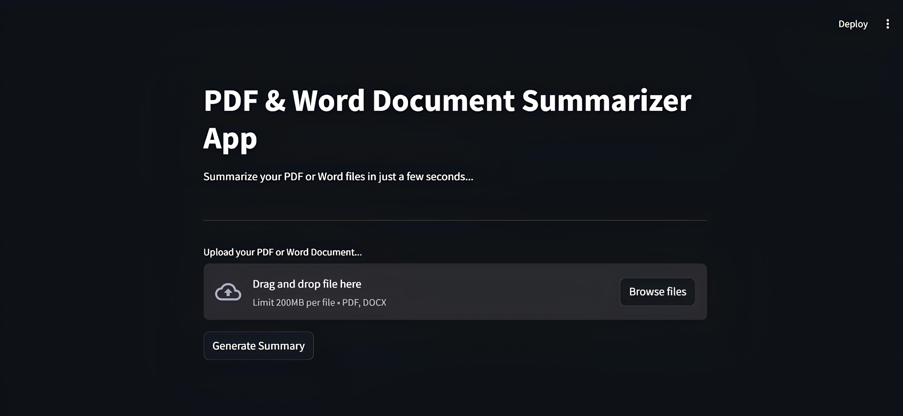

# AI Document Summarizer



## Overview

AI Document Summarizer is a web application that allows users to upload PDF or Word documents and receive concise summaries generated by a powerful Large Language Model (LLM) powered by the Gemini API. The app extracts text from documents, processes it with LangChain and FAISS for semantic search, and generates a meaningful summary in just a few seconds.

This tool is ideal for quickly digesting lengthy documents, research papers, reports, or any text-heavy files.

---

## Features

* Upload PDF and Word (.docx) files
* Robust text extraction from PDFs and Word documents
* Semantic text chunking and vectorization using FAISS
* Summarization powered by Gemini LLM via LangChain integration
* User-friendly interface built with Streamlit
* Handles corrupted or unreadable files gracefully with informative error messages

---

## Getting Started

### Prerequisites

* Python 3.8+
* Gemini API Key (set in `api_key.py`)

### Installation

1. Clone the repository:

```bash
git clone https://github.com/MoustafaMohamed01/llm-projects.git
cd llm-projects/ai-document-summarizer
```

2. Install dependencies:

```bash
pip install -r requirements.txt
```
**or:**
```bash
pip install streamlit langchain langchain-google-genai pypdf python-docx faiss-cpu
```

3. Add your Gemini API key:

Create `api_key.py` in the root directory and add:

```python
GEMINI_API_KEY = 'your_actual_api_key_here'
```

---

### Running the App

Run the Streamlit application with:

```bash
streamlit run app.py
```

Open the local URL provided by Streamlit to interact with the app.

---

## Project Structure

```
ai-document-summarizer/
│
├── images/                     # Screenshot and UI images
│   └── streamlit_app.jpg
├── api_key.py                  # API key configuration (not included in repo)
├── app.py                      # Main Streamlit app
├── utils.py                    # Core processing and summarization logic
├── requirements.txt            # Python dependencies
└── README.md                   # Project documentation
```

---

## How It Works

1. User uploads a PDF or DOCX file.
2. The app extracts raw text using `pypdf` or `python-docx`.
3. The extracted text is split into manageable chunks with overlaps.
4. Text chunks are embedded with Google Gemini embeddings and stored in a FAISS vector store.
5. The summarization query is run using a LangChain QA chain with the Gemini LLM.
6. The app displays the summarized text to the user.

---

## Troubleshooting

* If you get errors related to corrupted PDFs, the app will notify you with a descriptive message.
* Unsupported file types are rejected with clear feedback.
* Ensure your Gemini API key is valid and has the correct permissions.

---

## Contact

Created by **Moustafa Mohamed** — feel free to reach out!

* GitHub: [MoustafaMohamed01](https://github.com/MoustafaMohamed01)
* Linkedin: [Moustafa Mohamed](https://www.linkedin.com/in/moustafamohamed01/)
* Kaggle: [moustafamohamed01](https://www.kaggle.com/moustafamohamed01)
---
