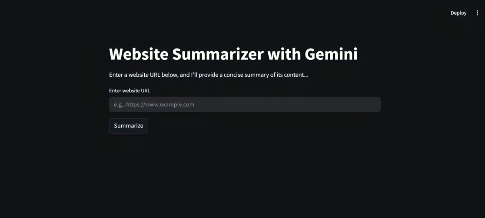

# AI Web Summarizer

An AI-powered tool that extracts and summarizes website content using two modes: **Google Gemini API** and **LLaMA 3.2 via Ollama**. The project includes a clean and interactive **Streamlit app** for non-technical users.



---

## Project Structure

```

ai-web-summarizer/
├── gemini/
│   └── web_summarizer_gemini.py       # Summarizer using Gemini API
├── ollama/
│   └── web_summarizer_llama.py        # Summarizer using LLaMA 3.2 via Ollama
├── streamlit_app/
│   ├── app.py                         # Streamlit user interface
│   └── api_key.py                     # Gemini API key loader
├── images/
│   └── streamlit_app.png              # Screenshot of the Streamlit app
├── requirements.txt                   # Python dependencies
└── README.md                          # Project documentation

````

---

## Features

- **URL Scraping** – Extracts the page title and main content from any public website.
- **Content Cleaning** – Removes unnecessary elements (scripts, styles, images).
- **Summarization Modes**:
  - **Gemini API** (cloud-based)
  - **LLaMA 3.2 via Ollama** (local inference)
- **Markdown Output** – Clean, structured summary format.
- **Streamlit UI** – Simple interface for input, visualization, and download.

---

## Setup & Installation

### Prerequisites

- Python 3.7+
- [Google Gemini API Key](https://ai.google.dev/gemini-api/docs/api-key) (for `Gemini`)
- [Ollama](https://ollama.com/) installed (for `LLaMA 3.2`, optional)

### Install Requirements

```bash
pip install -r requirements.txt
````

### Environment Setup

Copy the example and add your Gemini API key:

```bash
cp streamlit_app/api_key.py.example streamlit_app/api_key.py
# Then edit api_key.py to include your actual API key
```

### Optional: Set Up LLaMA 3.2 (Ollama)

```bash
curl -fsSL https://ollama.com/install.sh | sh
ollama pull llama3:latest
```

---

## How to Use

### Streamlit App

```bash
streamlit run streamlit_app/app.py
```

---

### CLI or Notebook Modes

#### Gemini

```bash
python gemini/web_summarizer_gemini.py
```

#### LLaMA 3.2 (Ollama)

```bash
python ollama/web_summarizer_llama.py
```

---

## Requirements

```txt
requests
beautifulsoup4
python-dotenv
google-generativeai
streamlit
IPython
```

Install with:

```bash
pip install -r requirements.txt
```

---

## Acknowledgments

* [Google AI Studio](https://makersuite.google.com/)
* [Ollama](https://ollama.com/)
* [LLM Engineering Course](https://www.udemy.com/course/llm-engineering-master-ai-and-large-language-models)

---

## Author
*Created by **Moustafa Mohamed** - feel free to reach out!*

* GitHub: [MoustafaMohamed01](https://github.com/MoustafaMohamed01)
* Linkedin: [Moustafa Mohamed](https://www.linkedin.com/in/moustafamohamed01/)
* Kaggle: [moustafamohamed01](https://www.kaggle.com/moustafamohamed01)
---
