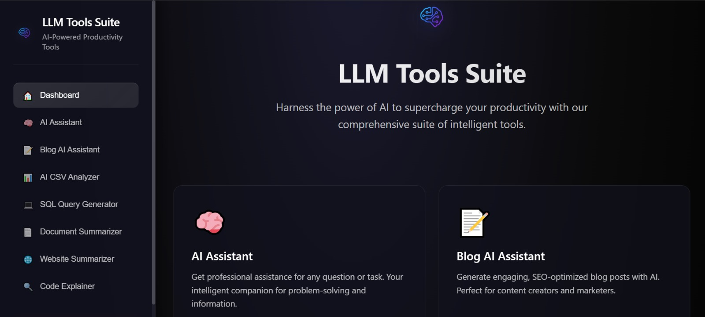
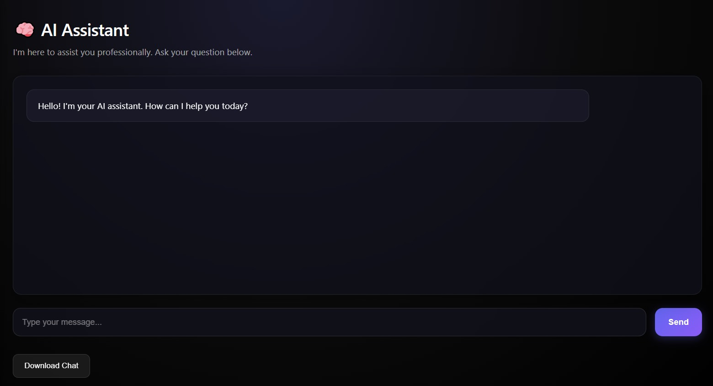
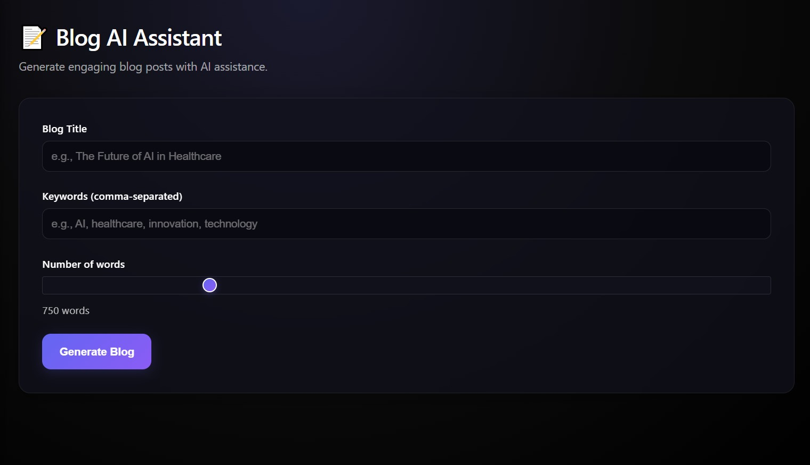
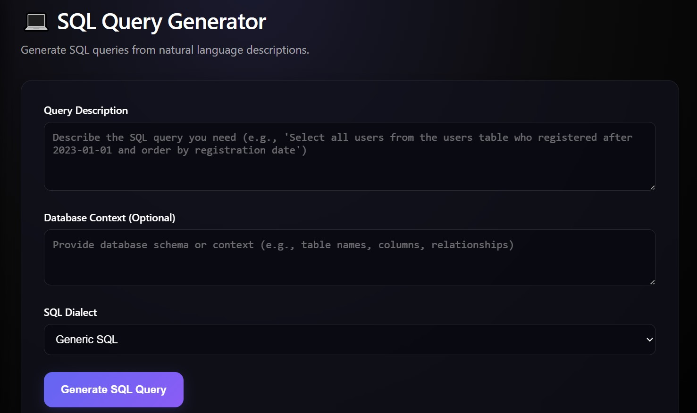
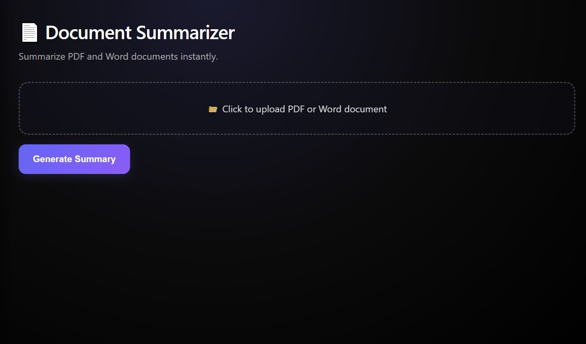
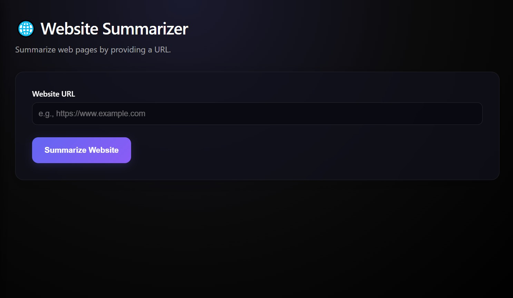
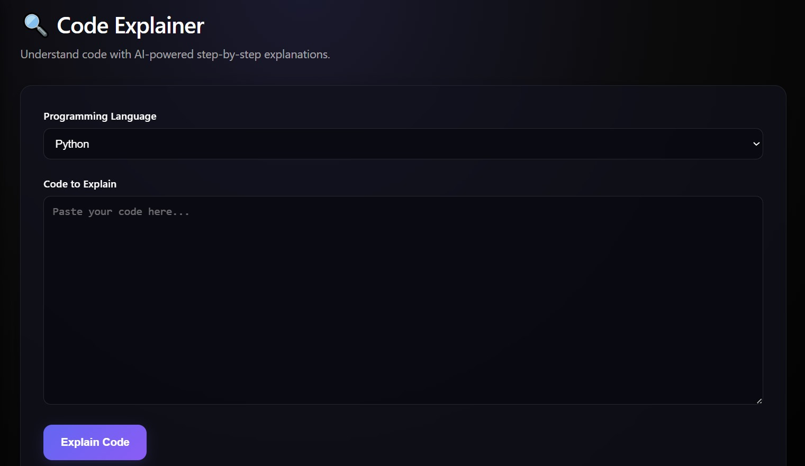

# LLM Tools Suite – Web Version (New Theme)

📛 **Badges**
Live Demo | License: MIT | Built with HTML, CSS, JavaScript | LLM: Google Gemini API | LangChain (via API Backend)

An updated **web version** of the **LLM Tools Suite**, redesigned with a **modern dashboard theme**.
This release introduces a **central homepage**, a **professional dark UI**, and **tool-specific screenshots** for a clearer overview.

---

## New in This Version

* **New Main Page** – Central dashboard for tool selection.
* **Updated Theme** – Modern, minimal dark interface.
* **Visual Updates** – Added logo and individual screenshots per tool.
* **Improved UX** – Faster, cleaner navigation between tools.

---

## Features

* 🧠 **AI Assistant** – Engage in natural, professional conversations with AI.
* 📝 **Blog AI Assistant** – Generate SEO-optimized blog posts.
* 📊 **AI CSV Analyzer** – Upload and analyze CSV data.
* 💻 **SQL Query Generator** – Convert natural language to SQL queries.
* 📄 **Document Summarizer** – Summarize PDF and Word files.
* 🌐 **Website Summarizer** – Extract and summarize website content.
* 🔍 **Code Explainer** – Understand and explain code snippets.

---

## 🖼 Screenshots

### Main Dashboard


### Tools Overview
| AI Assistant | Blog AI Assistant | CSV Analyzer |
|-------------|-----------------|--------------|
|  |  |  |

| SQL Query Generator | Document Summarizer | Website Summarizer | Code Explainer |
|-------------------|------------------|------------------|----------------|
|  |  |  |  |

---

## Project Structure

```
new-theme/
│
├── index.html            # Main web page (dashboard theme)
├── style.css             # Styling (dark theme, responsive design)
├── script.js             # JavaScript functionality
│
├── images/
│   └── logo.png          # App logo
│
├── screenshots/          # Tool screenshots
│   ├── main-page.jpg
│   ├── ai-assistant.jpg
│   ├── blog-assistant.jpg
│   ├── csv-analyzer.jpg
│   ├── sql-query-generator.jpg
│   ├── document-summarizer.jpg
│   ├── website-summarizer.jpg
│   └── code-explainer.jpg
│
└── README.md             # This file
```

---

## Installation & Usage

1. **Clone the repository**

   ```bash
   git clone https://github.com/MoustafaMohamed01/llm-projects.git
   cd llm-projects/llm-tools-suite/v2-web/new-theme
   ```

2. **Open the app**
   Simply open `index.html` in your browser.

   > No server required for the basic frontend version.

3. **API Key Setup (if required)**

   * In `script.js`, replace the placeholder with your **Gemini API key**.
   * Do **not commit** your API key to GitHub. Use environment variables or a secure backend if deploying online.

---

## Built With

* **HTML5** – Structure
* **CSS3** – Styling & responsive design
* **JavaScript (Vanilla JS)** – Frontend logic
* **Google Gemini API** – Large Language Model backend
* **LangChain** – For advanced chain logic (if backend integrated)

---

## About Me

**Moustafa Mohamed** – Aspiring AI Developer | Specializing in ML, DL, and LLM Engineering

* GitHub: [MoustafaMohamed01](https://github.com/MoustafaMohamed01)
* LinkedIn: [Moustafa Mohamed](https://linkedin.com/in/moustafamohamed01)
* Kaggle: [moustafamohamed01](https://kaggle.com/moustafamohamed01)
* Portfolio: [moustafamohamed](https://moustafamohamed.netlify.app/)

---

