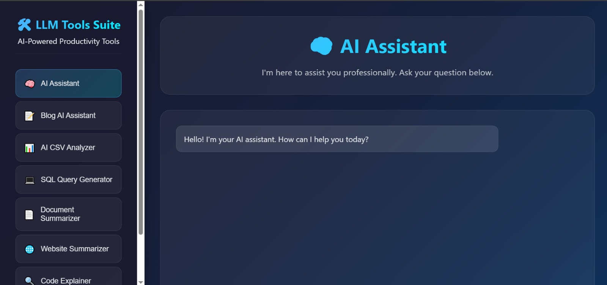
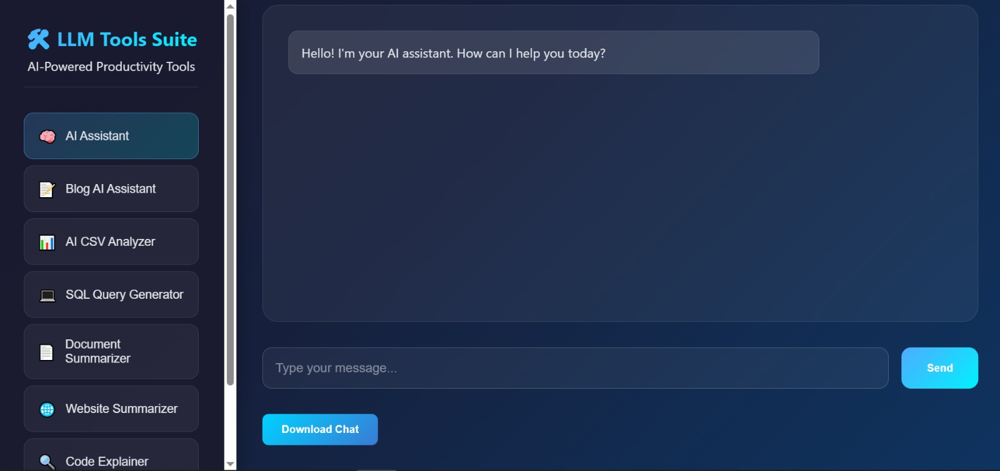

# LLM Tools Suite – Web Version (v2)

📛 **Badges**
Live Demo | License: MIT | Built with HTML, CSS, JavaScript | LLM: Google Gemini API | LangChain (via API Backend)

An updated version of the **LLM Tools Suite**, redesigned as a **lightweight HTML, CSS, and JavaScript web app**. This version provides a simple and fast interface for interacting with AI-powered tools directly from the browser.

---

## Features

The web version includes the following tools:

* 🧠 **AI Assistant** – Engage in professional, natural language conversations with an AI assistant.
* 📝 **Blog AI Assistant** – Generate blog posts from a title, keywords, and word count.
* 📊 **AI CSV Analyzer** – Upload CSV files and get quick insights and analysis.
* 💻 **SQL Query Generator** – Convert natural language into SQL queries.
* 📄 **Document Summarizer** – Summarize PDF and Word documents.
* 🌐 **Website Summarizer** – Extract and summarize content from web pages.
* 🔍 **Code Explainer** – Understand and explain snippets of code.

---

## Screenshots

🧠 **AI Assistant**


📊 **AI CSV Analyzer**


---

## Project Structure

```
v2-web/
│
├── index.html        # Main web page
├── style.css         # Styling
├── script.js         # JavaScript functionality
├── screenshots/      # Images for documentation
│   ├── overview.jpg
│   └── overview_2.jpg
└── README.md         # This file
```

---

## Installation & Usage

1. **Clone the repository**

   ```bash
   git clone https://github.com/MoustafaMohamed01/llm-projects.git
   cd llm-projects/llm-tools-suite/v2-web
   ```

2. **Open the app**
   Simply open `index.html` in your browser.

   > No server required for the basic frontend version.

3. **API Key Setup (if required)**

   * In `script.js`, replace the placeholder with your **Gemini API key**.
   * Make sure **not to commit** your API key to GitHub. Instead, load it from a secure backend or environment variable if deploying online.

---

## Deployment

### Option 1: GitHub Pages

1. Push this `v2-web` folder to your repo.
2. Enable **GitHub Pages** under repository settings.
3. Select the `main` branch and `/llm-tools-suite/v2-web` folder.
4. Your app will be available online at:

   ```
   https://MoustafaMohamed01.github.io/llm-projects/llm-tools-suite/v2-web/
   ```

### Option 2: Netlify / Vercel (recommended)

* Drag and drop this folder into Netlify, or connect your repo.
* Add your API key as an **environment variable** in the hosting dashboard.

---

## Built With

* **HTML5** – Structure
* **CSS3** – Styling & responsive design
* **JavaScript (Vanilla JS)** – Frontend logic
* **Google Gemini API** – Large Language Model backend
* **LangChain** – For advanced chain logic (if backend integrated)

---

## To-Do

* Add file drag-and-drop support for CSV and documents
* Add light/dark mode toggle
* Improve error handling for API failures
* Extend Code Explainer to support multiple languages

---

## About Me

👨‍💻 **Moustafa Mohamed** – Aspiring AI Developer | Specializing in ML, DL, and LLM Engineering

* GitHub: [MoustafaMohamed01](https://github.com/MoustafaMohamed01)
* LinkedIn: [Moustafa Mohamed](https://linkedin.com/in/moustafamohamed01)
* Kaggle: [moustafamohamed01](https://kaggle.com/moustafamohamed01)
* Portfolio: [moustafamohamed](https://moustafamohamed.netlify.app/)
